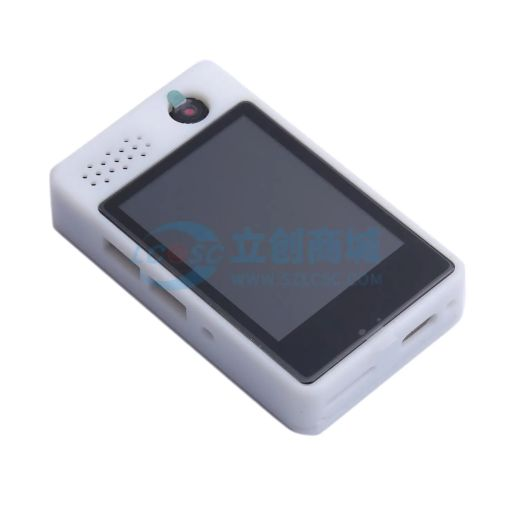
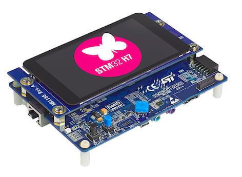

[中文点这里](./README_zh.md)

## What is OSKey?

OSKey (Open Source Key) is a fully open-source, non-commercial hardware wallet project. Our first mission is to help you create your own trustless hardware wallet and finally, it will be the key to verifying your identity in the digital world.

Unlike commercial hardware products, where open-source is used to drive sales of their commercial products, our focus is on building open-source infrastructure and creating a trustless open-source software and hardware system.

We don't restrict users to specific chip manufacturers or models. Users have the freedom to choose from over 200 chips from more than 10 manufacturers, and can work with over 3000 development boards made by chip manufacturers or third parties. For example, popular open hardware platforms like Arduino or Raspberry Pi.

Users can also create their own development boards based on our reference designs, which we will soon release.

The Open Hardware Wallet supports multiple hardware architectures and is optimized for resource-constrained devices with security built-in. The cheapest supported MCU costs only $0.3, with optional support for Bluetooth, WiFi, and display capabilities.

## What can this product do?

We are building core infrastructure connecting digital world with real world. Not just a hardware wallet.

### **Guide**

**[Quick Start Guide](https://github.com/butterfly-community/oskey-firmware/tree/master/doc/start)**

### Feature:

#### ✅ Mnemonic Generation and Import on chip.

[BIP39](https://github.com/bitcoin/bips/blob/master/bip-0039.mediawiki) All [unit tests](https://github.com/butterfly-community/-lib-wallets/blob/main/src/mnemonic.rs) completed successfully.

#### ✅ HD (Hierarchical Deterministic) Wallet and Path Derivation on chip.

[BIP32](https://github.com/bitcoin/bips/blob/master/bip-0032.mediawiki) All [unit tests](https://github.com/butterfly-community/oskey-lib-wallets/blob/main/src/wallets.rs) completed successfully.

### Demo Video:

## How to Use the Firmware

### Pre-compiled Firmware

We provide pre-compiled firmware for development boards we own. Please check the [Releases](https://github.com/butterfly-community/oskey-firmware/releases) section on the right or see below for our available development boards.

### Self-compiled Firmware

If your development board is not included in pre-compiled firmware, please check the following links to set up the development environment and compile firmware for your board.

[Click here](doc/start/Compile.md)

## Development Boards

We also provide direct support for over 300 development boards without any modifications needed. For a complete list, please check our [Supported Boards](https://docs.zephyrproject.org/latest/boards/index.html) documentation.

Due to the wide variety of development board models available, only the chip price is listed here. Please select your preferred development board.

### Base experience

We carefully selected 4 development boards representing 3 different architectures from 5 different chip manufacturers as our officially supported boards. This demonstrates our vendor-independent capability. Our developers actively develop and test on these boards.

 

|     Name     | [ESP32&nbsp;C3](https://docs.zephyrproject.org/latest/boards/espressif/esp32c3_devkitm/doc/index.html)&nbsp; | [Raspberry&nbsp;Pi&nbsp;Pico](https://docs.zephyrproject.org/latest/boards/raspberrypi/rpi_pico/doc/index.html)  | [Nucleo F401RE](https://docs.zephyrproject.org/latest/boards/st/nucleo_f401re/doc/index.html) | [nRF52840-MDK](https://docs.zephyrproject.org/latest/boards/makerdiary/nrf52840_mdk/doc/index.html) |
| :----------: | :----------------------------------------------------------------------------------------------------------: | :--------------------------------------------------------------------------------------------------------------: | :-------------------------------------------------------------------------------------------: | :-------------------------------------------------------------------------------------------------: |
|    Image     |                                      |                                                                       |                                                |                                                  |
| Manufacturer |                                                  Espressif                                                   |                                                   Raspberry Pi                                                   |                                      STMicroelectronics                                       |                                        Nordic Semiconductor                                         |
|     Chip     |                                                   ESP32C3                                                    |                                                      RP2040                                                      |                                            STM32F4                                            |                                              nRF52840                                               |
| Architecture |                                                    RISC-V                                                    |                                                  Arm Cortex-M0                                                   |                                         ARM Cortex-M4                                         |                                            ARM Cortex-M4                                            |
|  MCU Price   |                                                    \$0.5                                                     |                                                      \$0.8                                                       |                                              \$2                                              |                                                 \$3                                                 |

### Fully experience

These models have screens and touch support, giving them full functionality as hardware wallets.

 

|  Name   |                                [Lichuang ESP32-S3](https://item.szlcsc.com/43285221.html)                                 | [STM32H747I Discovery](https://docs.zephyrproject.org/latest/boards/st/stm32h747i_disco/doc/index.html#stm32h747i_disco) |
| :-----: | :-----------------------------------------------------------------------------------------------------------------------: | :----------------------------------------------------------------------------------------------------------------------: |
|  Image  |  |             |
| Display |                                                          2-inch                                                           |                                                          4-inch                                                          |
|  Price  |                                                           \$20                                                            |                                                          \$100                                                           |

By default, the chip on the development board is not security-locked and has no security features enabled.

Each chip model has its own specific locking protocol that varies by manufacturer. Please refer to your chip's technical documentation.

## Powered by

|  |  |
| -------------------------------------------------------------------------------------------------------------------------------------------------------- | -------------------------------------------------------------------------------------------------------------------------------------------------------------- |
