<!-- SPDX-License-Identifier: MPL-2.0 -->

[中文点这里](./README_zh.md)

## What is OSKey?

OSKey (Open Source Key) is a fully open-source, non-commercial hardware wallet project. Our first mission is to help you create your own trustless hardware wallet and, ultimately, make it the key to verifying your identity in the digital world.

Unlike commercial hardware products, where open-source is used to drive sales of their commercial products, our focus is on building open-source infrastructure and creating a trustless open-source software and hardware system.

We don't restrict users to specific chip manufacturers or models. Users have the freedom to choose from over 200 chips from more than 10 manufacturers, and can work with over 3000 development boards made by chip manufacturers or third parties. These include popular open hardware platforms like Arduino and Raspberry Pi.

Users can also create their own development boards based on our reference designs, which we will soon release.

OSKey supports multiple hardware architectures and is optimized for resource-constrained devices with security built in. The cheapest supported MCU costs only $0.3, with optional support for Bluetooth, Wi-Fi, and a display.

OSKey provides a collection of modules ready to combine. Like building blocks for hardware, they put wallet, security, connectivity, and interaction capabilities in your hands. Start with a small development board, or build around your daily habits to create a device with a character of its own:

- **Wallet and signing:** mnemonic generation and import, HD wallet derivation, and message and transaction signing.
- **PIN and secure element:** wallet locking and unlocking, seed storage, and NXP A5000 management.
- **FIDO2 authentication:** USB authentication and on-device confirmation.
- **Display and touch:** the device interface, touch input, and signing confirmation.
- **Connectivity:** Bluetooth, Wi-Fi, USB, and MQTT.
- **Camera and QR codes:** image capture, QR scanning, and air-gapped signing.
- **Audio:** speaker output and volume control.
- **Motion sensing:** six-axis accelerometer and gyroscope data, and orientation fusion.
- **Storage:** persistent settings and SD card file browsing.
- **Firmware updates:** signed firmware updates through Bluetooth or UART.

### Hardware Sovereignty

As AI advances, hardware sovereignty is now in our hands, along with the freedom to give our ideas a physical form. Describe what you want in your own words, and work with AI to combine modules, lay out a PCB, and design an enclosure. The device you imagine begins to take shape in your hands. A passing thought or a sketch on paper can be the beginning.

It could be a tiny key you carry everywhere, or a companion on your desk with a screen, camera, and touch interface. The shape of the board, the placement of its ports, and the curves and texture of its enclosure can all reflect your preferences. You choose how it works and how it fits into your life.

Hardware of your own carries both your keys and your choices. OSKey provides the modules; AI helps bring your ideas to life. From the features you choose to the layout of the PCB and the feel of the enclosure in your palm, the device takes the shape you give it.

## What can this product do?

We are building core infrastructure connecting the digital world with the real world. Not just a hardware wallet.

### Guide

**[Quick Start Guide](https://github.com/butterfly-community/oskey-firmware/tree/master/docs/start)**

### Features

#### ✅ On-Chip Mnemonic Generation and Import

[BIP39](https://github.com/bitcoin/bips/blob/master/bip-0039.mediawiki) All [unit tests](https://github.com/butterfly-community/oskey-lib-wallets/blob/main/src/mnemonic.rs) completed successfully.

#### ✅ On-Chip HD (Hierarchical Deterministic) Wallet and Path Derivation

[BIP32](https://github.com/bitcoin/bips/blob/master/bip-0032.mediawiki) All [unit tests](https://github.com/butterfly-community/oskey-lib-wallets/blob/main/src/wallets.rs) completed successfully.

#### ✅ Ethereum Message and Transaction Signing

Sign Ethereum personal messages (EIP-191) and transactions (EIP-2930), with on-device review and confirmation.

#### ✅ Air-Gapped Signing

Exchange signing requests and results through QR codes. Scan a request with the camera, review and sign it on the device, and display the signature as a QR code.

#### ✅ PIN Wallet Management

Set a PIN to unlock and lock the wallet, manage seed storage, and initialize or erase the wallet from the device interface.

#### ✅ Optional NXP Secure Element

Use an NXP A5000 secure element to store the seed and control access through PIN authentication. The chip enforces a ten-attempt limit; after lockout, erase and initialize the wallet to start again. A dedicated management page provides chip status, initialization, and wallet erasure. The software wallet backend is used when this module is disabled.

#### ✅ FIDO2 Authentication

Use OSKey as a USB FIDO2 authenticator for OpenSSH and other FIDO2 applications, with on-device confirmation.

#### ✅ Connectivity and Hardware Interaction

Connect through Bluetooth, provision Wi-Fi from the device, and interact through a touchscreen, camera, audio, six-axis IMU, and SD card file browser.

#### ✅ Signed Firmware Updates

Update firmware through Bluetooth or UART with MCUboot signature verification and version rollback protection.

#### ✅ Modular Feature Selection

Choose wallet, secure-element, display, connectivity, and peripheral modules at build time to create a firmware configuration for your hardware and use case.

### Feature Demo

#### Initialization

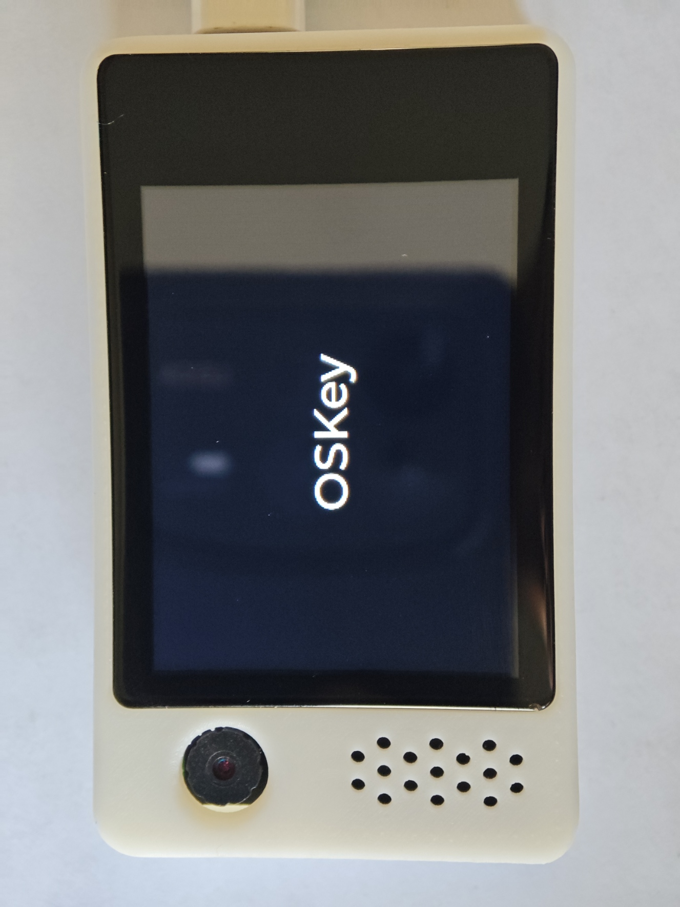 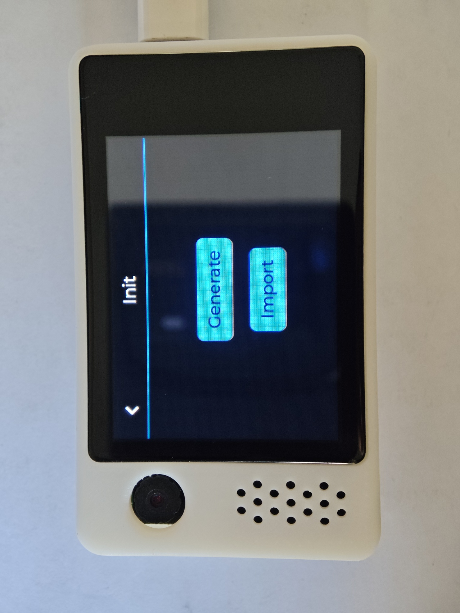

#### Generate Mnemonic

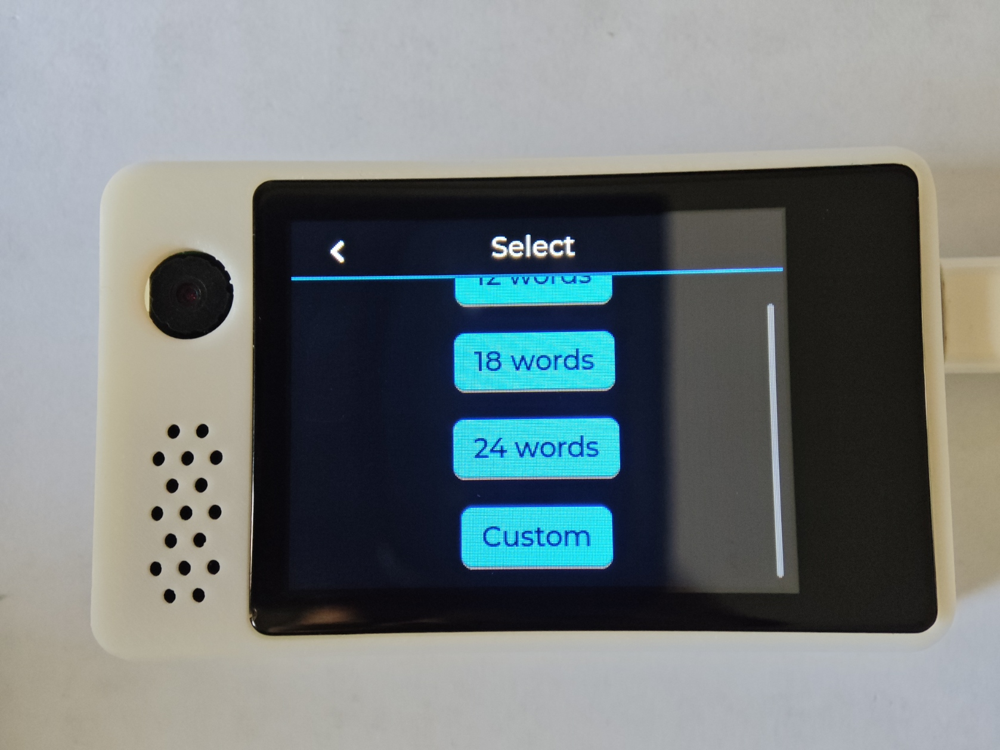 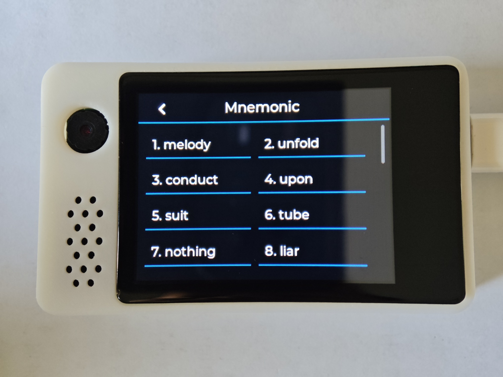 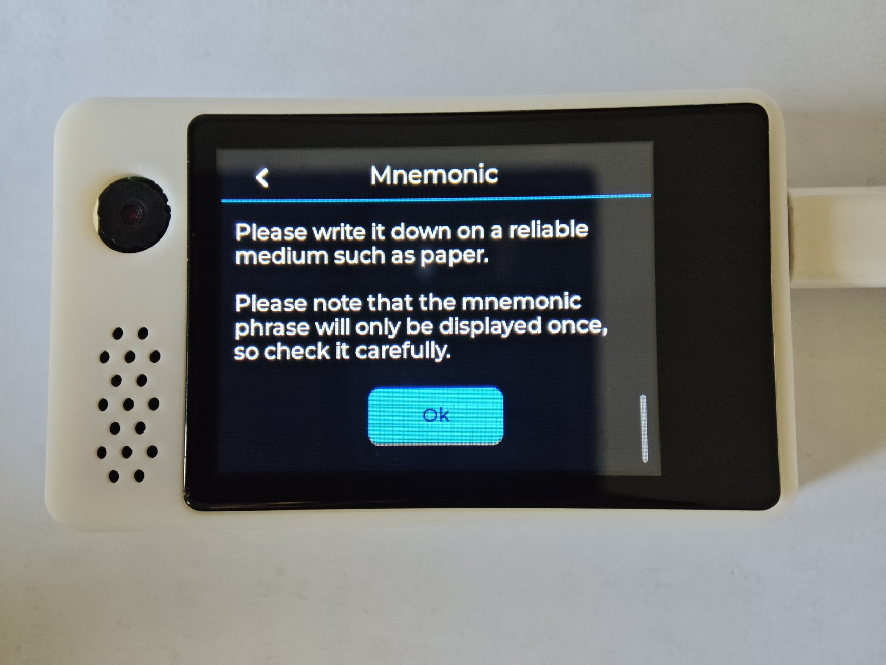

#### Custom Mnemonic Generation

 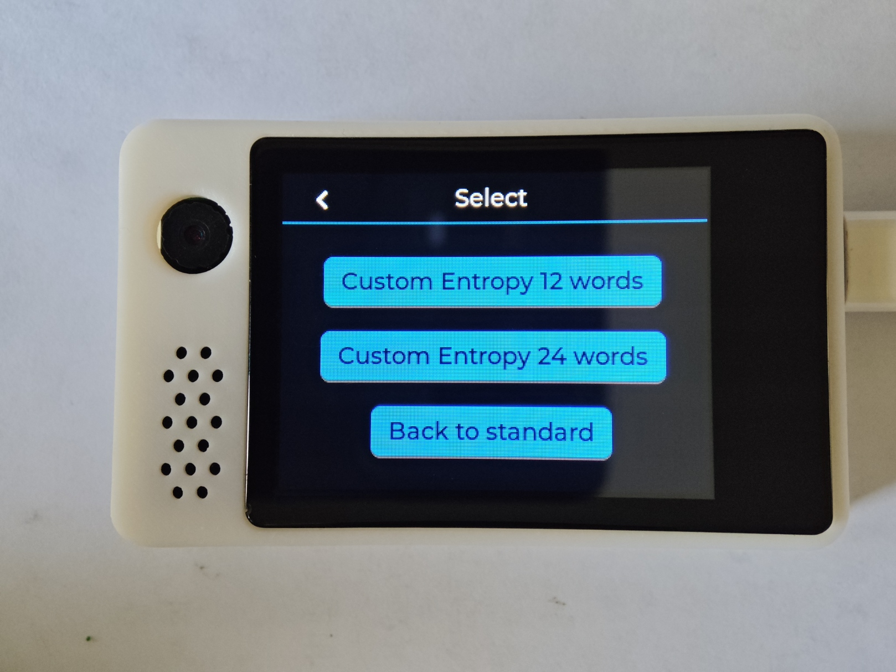 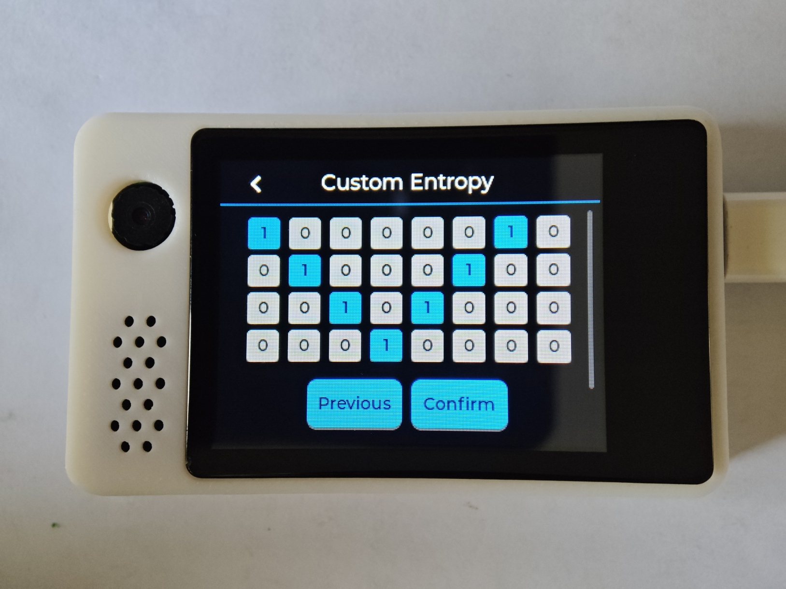

#### Import Mnemonic

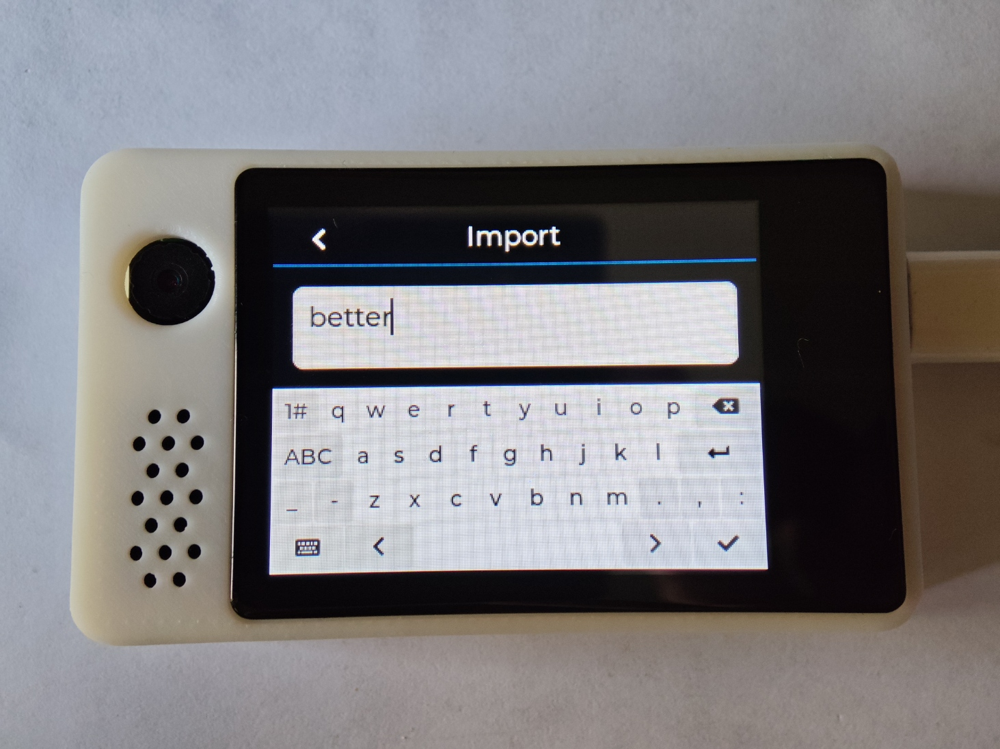

#### Index

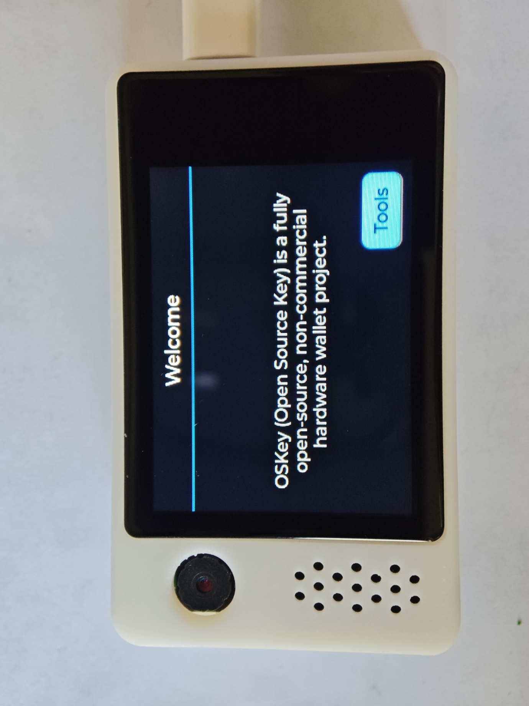

## How to Use the Firmware

### Pre-compiled Firmware

We provide pre-compiled firmware for development boards we own. Please check the [Releases](https://github.com/butterfly-community/oskey-firmware/releases) section on the right or see below for our available development boards.

### Self-compiled Firmware

If your development board is not included in pre-compiled firmware, please check the following links to set up the development environment and compile firmware for your board.

[Click here](docs/start/compile.md)

## Development Boards

We also provide direct support for over 300 development boards without any modifications needed. For a complete list, please check our [Supported Boards](https://docs.zephyrproject.org/latest/boards/index.html) documentation.

Due to the wide variety of development board models available, only the chip price is listed here. Please select your preferred development board.

### Basic Experience

We carefully selected 2 development boards representing 1 architecture from 2 different chip manufacturers as our officially supported boards. This demonstrates our vendor-independent capability. Our developers actively develop and test on these boards.

 

|     Name     | [Nucleo F401RE](https://docs.zephyrproject.org/latest/boards/st/nucleo_f401re/doc/index.html) | [nRF52840-MDK](https://docs.zephyrproject.org/latest/boards/makerdiary/nrf52840_mdk/doc/index.html) |
| :----------: | :-------------------------------------------------------------------------------------------: | :-------------------------------------------------------------------------------------------------: |
|    Image     |                        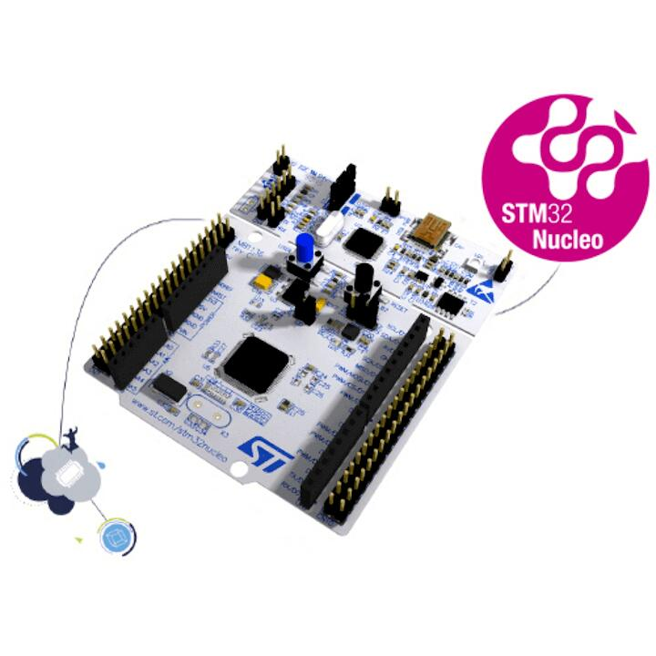                        |                         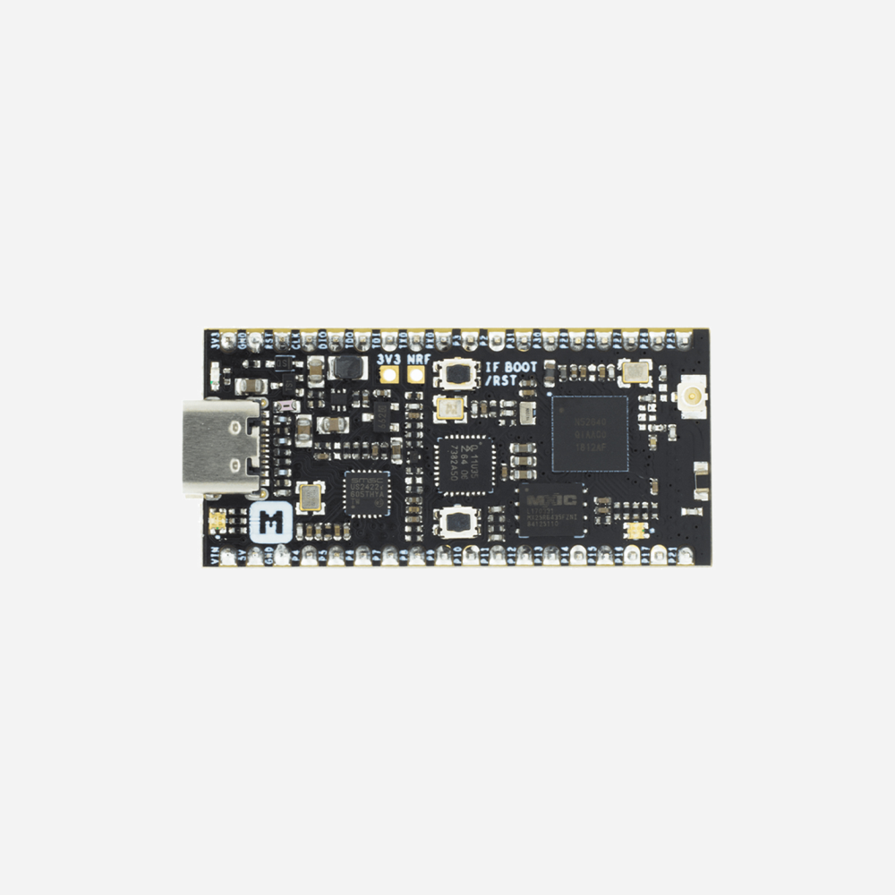                         |
| Manufacturer |                                      STMicroelectronics                                       |                                        Nordic Semiconductor                                         |
|     Chip     |                                            STM32F4                                            |                                              nRF52840                                               |
| Architecture |                                         ARM Cortex-M4                                         |                                            ARM Cortex-M4                                            |

### Full Experience

These models have screens and touch support, giving them full functionality as hardware wallets.

 

|  Name   |                                [Lichuang ESP32-S3](https://item.szlcsc.com/43285221.html)                                 | [STM32H747I Discovery](https://docs.zephyrproject.org/latest/boards/st/stm32h747i_disco/doc/index.html#stm32h747i_disco) |
| :-----: | :-----------------------------------------------------------------------------------------------------------------------: | :----------------------------------------------------------------------------------------------------------------------: |
|  Image  | 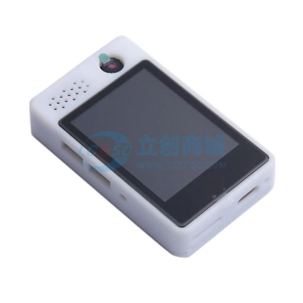 |      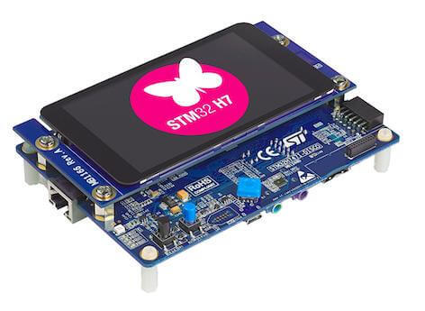       |
| Display |                                                          2-inch                                                           |                                                          4-inch                                                          |

By default, the chip on the development board is not security-locked and has no security features enabled.

Each chip model has its own specific locking protocol that varies by manufacturer. Please refer to your chip's technical documentation.

## Powered by

| <a href="https://www.gccofficial.org/" target="_blank">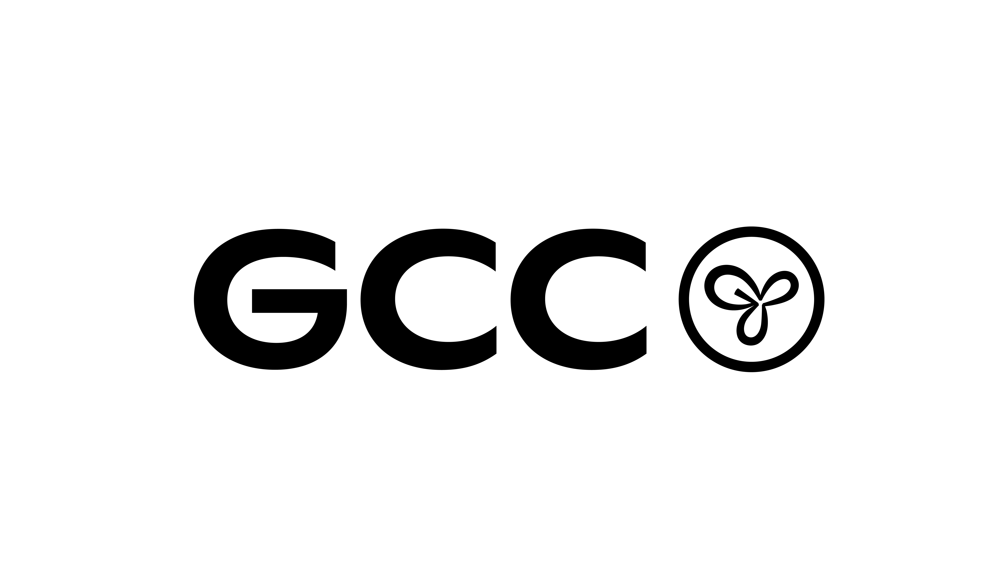</a> |  |
| -------------------------------------------------------------------------------------------------------------------------------------------------------- | -------------------------------------------------------------------------------------------------------------------------------------------------------------- |

## License

Original OSKey files are licensed under the Mozilla Public License 2.0. Files
derived from Zephyr, Espressif, and other third-party projects retain their own
license notices. See [THIRD_PARTY_NOTICES.md](THIRD_PARTY_NOTICES.md) for details.
