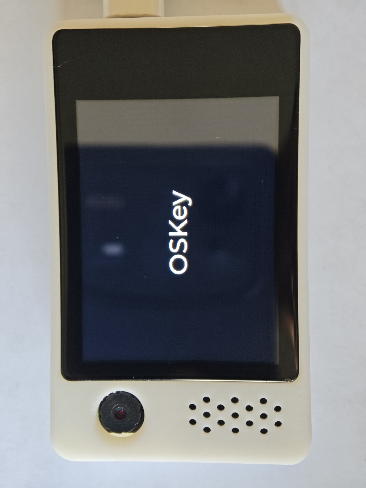
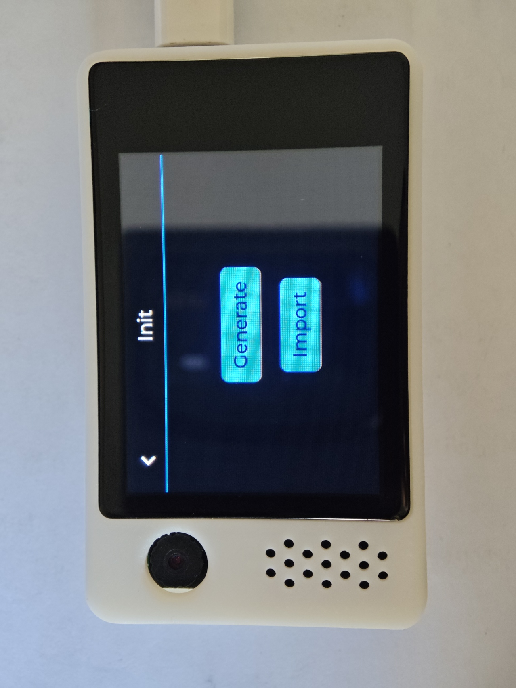
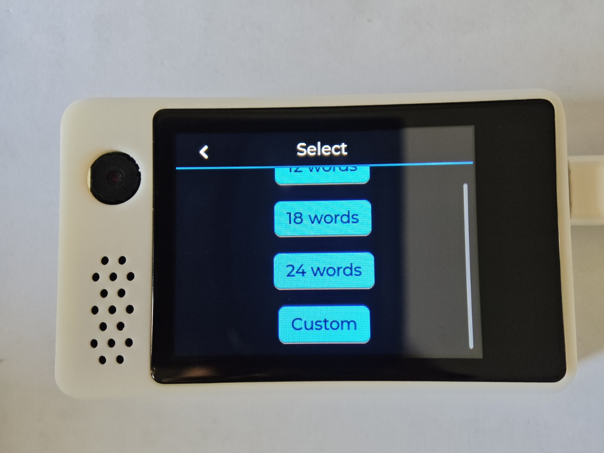
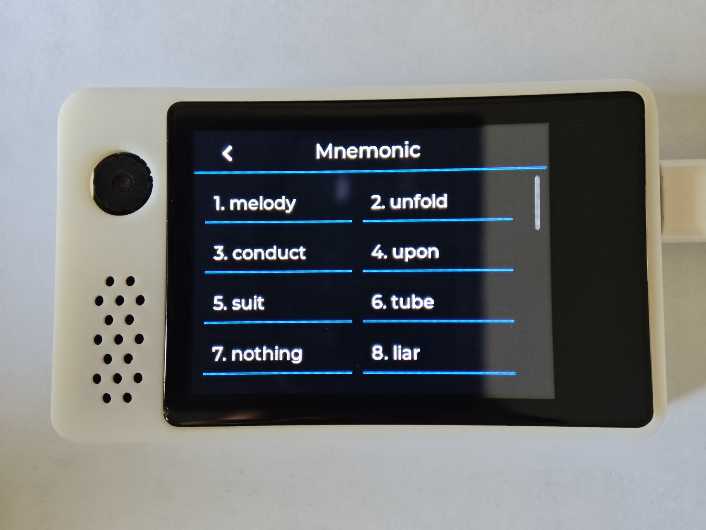
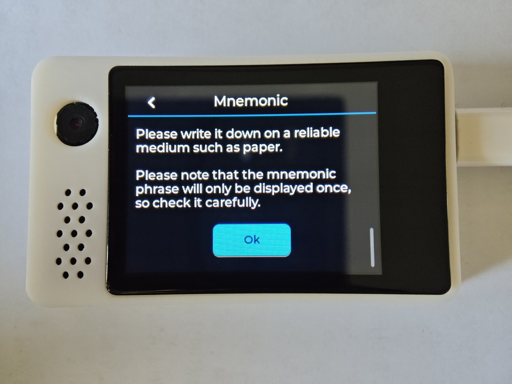
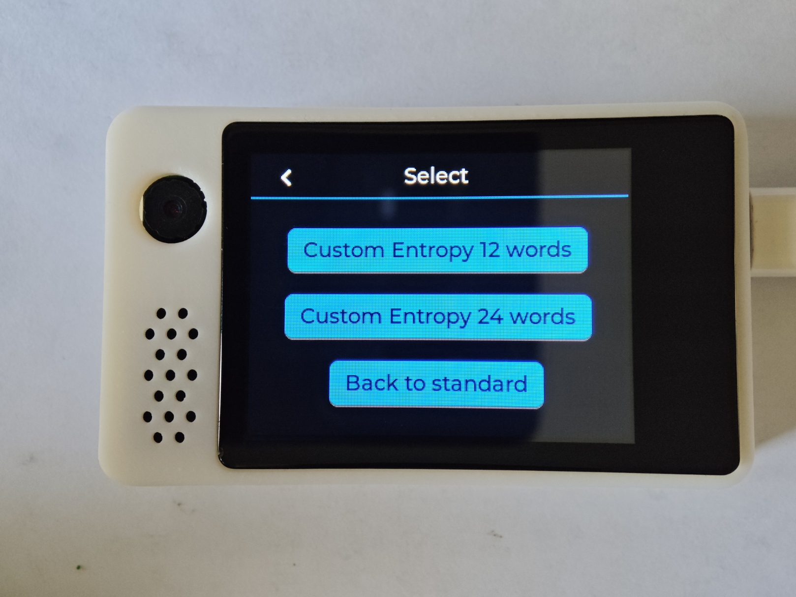
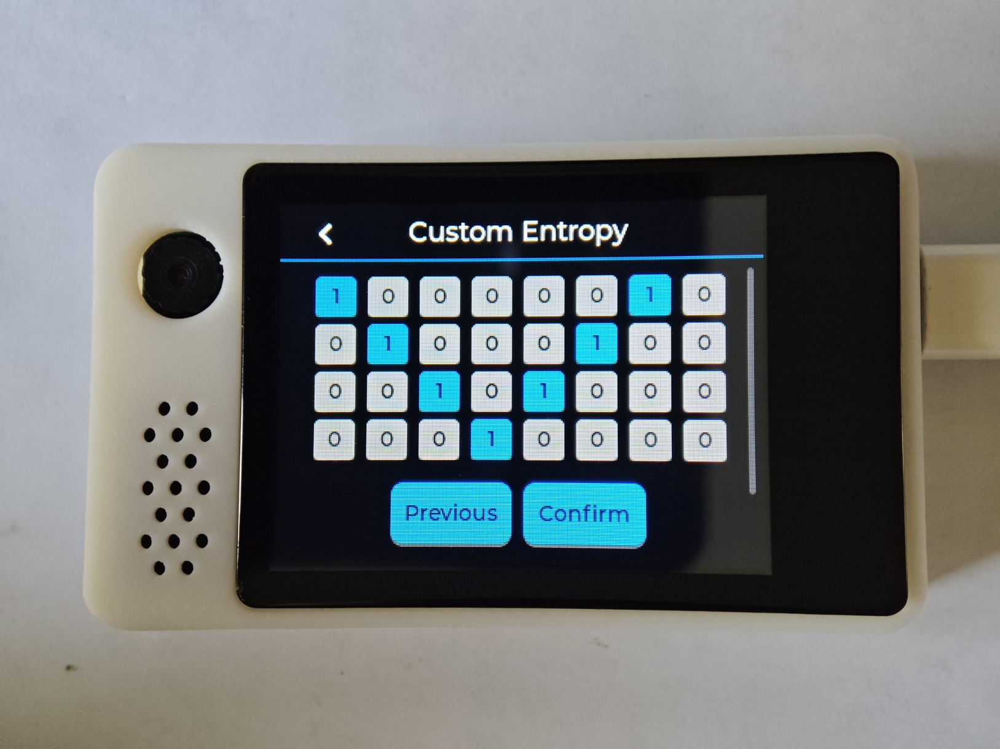
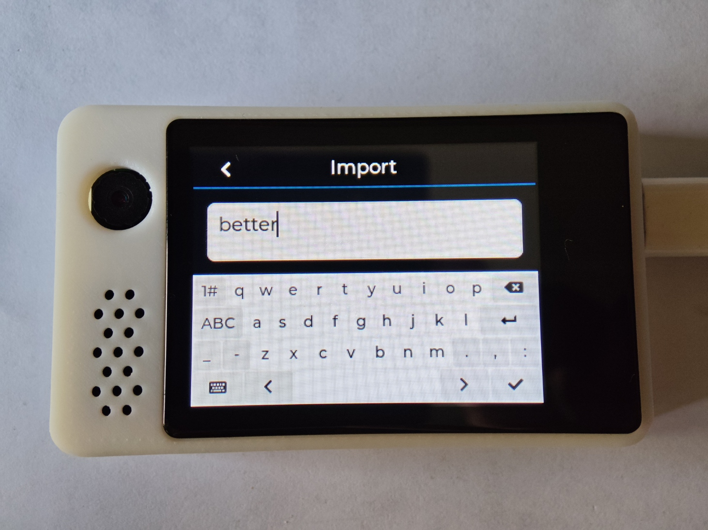
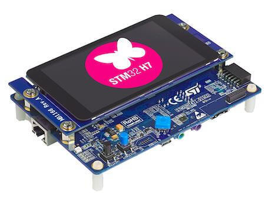

## OSKey 是什么？

OSkey (Open Source Key) 是一个完全开源的非商业产品的硬件钱包项目。我们的首要使命是帮助您创建并使用自己的无需信任的硬件钱包，并最终成为您在数字世界管理身份的关键设施。

与使用开源来推动其商业产品销售的商业硬件产品不同，我们的开源重点是构建开源基础设施，打造一个去信任的开源软硬件系统。

我们不限制特定的芯片制造商或型号。用户可以自由选择来自 10 多家制造商的 200 多种芯片，并可以使用芯片制造商或第三方制造的 3000 多种开发板，比如可以选择 Arduino 或 Raspberry Pi 等产品。

用户还可以根据我们即将发布的参考设计创建自己的开发板。

OSKey 支持多种硬件架构，针对资源受限设备进行了优化，并在最开始设计时就考虑安全性。支持的最便宜的 MCU 价格仅为 0.3 美元，其他还有可选的支持蓝牙和 WiFi 还有屏幕。

## OSkey 可以做什么?

我们构建了数字世界和真实世界的桥梁，这不仅仅是一个硬件钱包。

### **快速指南**

**[快速使用指南](https://github.com/butterfly-community/oskey-firmware/tree/master/doc/start)**

### 功能:

#### ✅ 芯片内助记词生成和导入

[BIP39](https://github.com/bitcoin/bips/blob/master/bip-0039.mediawiki) 完成所有 [unit tests](https://github.com/butterfly-community/oskey-lib-wallets/blob/main/src/mnemonic.rs).

#### ✅ HD (Hierarchical Deterministic) 分层确定性钱包.

[BIP32](https://github.com/bitcoin/bips/blob/master/bip-0032.mediawiki) 完成所有 [unit tests](https://github.com/butterfly-community/oskey-lib-wallets/blob/main/src/wallets.rs).

### 功能展示

#### 初始化选择

 

#### 生成助记词

  

#### 自定义生成助记词

  

#### 导入助记词

## 如何使用固件

### 预编译固件

我们会为我们拥有的开发板预编译固件，请查看右侧 [Release](https://github.com/butterfly-community/oskey-firmware/releases) 下载或者下文查看我们拥有哪些开发板。

### 自编译固件

如果开发板不在预编译固件中，请查看以下链接设置开发环境，为开发板编译固件。

[点击此处](doc/start/Compile_zh.md)

## 开发板

除了我们拥有的开发板，也直接支持其他 300+ 款开发板，请查看支持列表 [Supported Boards](https://docs.zephyrproject.org/latest/boards/index.html)。

由于开发板型号太多，这里只写了芯片的价格。请自行选择喜欢的开发板。

### 基础体验

我们特意选择了来自不同的 4 个芯片制造商的 3 种架构的开发板作为官方支持，以展示我们不受供应商锁定的能力。开发者会在这些开发板上开发测试。

 

| 名称 | [ESP32&nbsp;C3](https://docs.zephyrproject.org/latest/boards/espressif/esp32c3_devkitm/doc/index.html) | [Raspberry&nbsp;Pi&nbsp;Pico](https://docs.zephyrproject.org/latest/boards/raspberrypi/rpi_pico/doc/index.html) | [Nucleo F401RE](https://docs.zephyrproject.org/latest/boards/st/nucleo_f401re/doc/index.html) | [nRF52840-MDK](https://docs.zephyrproject.org/latest/boards/makerdiary/nrf52840_mdk/doc/index.html) |
| :--: | :----------------------------------------------------------------------------------------------------: | :-------------------------------------------------------------------------------------------------------------: | :-------------------------------------------------------------------------------------------: | :-------------------------------------------------------------------------------------------------: |
| 图片 |                                   |                                                                      |                                                |                                                  |
| 厂商 |                                               Espressif                                                |                                                   RaspberryPi                                                   |                                      STMicroelectronics                                       |                                        Nordic Semiconductor                                         |
| 芯片 |                                              ESP32-C3FH4                                               |                                                     RP2040                                                      |                                         STM32F401RET6                                         |                                              nRF52840                                               |
| 架构 |                                                 RISC-V                                                 |                                                  ARM Cortex-M0                                                  |                                         ARM Cortex-M4                                         |                                            ARM Cortex-M4                                            |

### 完整体验

这些型号具有屏幕和触摸支持，可以体验硬件钱包的完整功能。

|   名称   |                                 [Lichuang ESP32-S3](https://item.szlcsc.com/43285221.html)                                 |    [STM32H747I Discovery](https://docs.zephyrproject.org/latest/boards/st/stm32h747i_disco/doc/index.html)    |
| :------: | :------------------------------------------------------------------------------------------------------------------------: | :-----------------------------------------------------------------------------------------------------------: |
|   图片   | ` |  |
| 屏幕尺寸 |                                                           2-inch                                                           |                                                    4-inch                                                     |

默认情况下开发板的芯片未经过安全锁定，不具备任何安全功能。如何锁定芯片请查询对应芯片的文档。

## Powered by

|  |  |
| -------------------------------------------------------------------------------------------------------------------------------------------------------- | -------------------------------------------------------------------------------------------------------------------------------------------------------------- |
