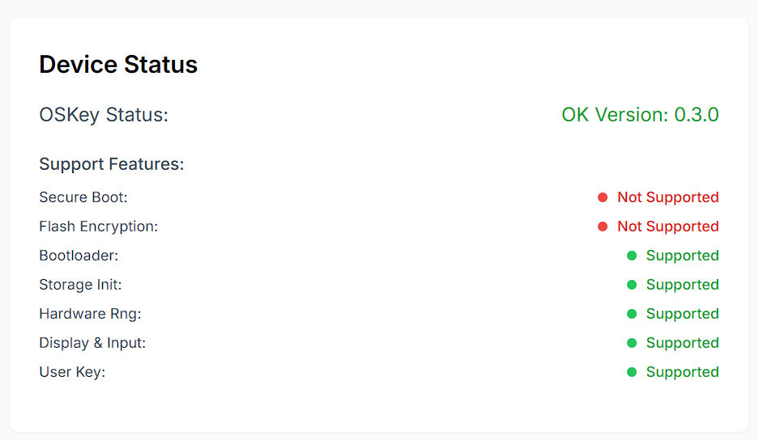

## 固件快速写入指南

如果您已经购买或者申请到了我们的官方开发板，正在思考如何使用和体验，不用担心，我们已经为您准备了完整的使用说明。

## 开发板

如果您的开发板外观符合以下图片，则适用这个使用指南。开发板适用于多种用途，适合 [butterfly-community](https://github.com/butterfly-community) 开源的绝大多数项目。开发板写入对应固件就可以执行对应的功能，比如写入 [OSKey](https://github.com/butterfly-community/oskey-firmware) 就可以变为数字货币硬件钱包，写入 [water-heater](https://github.com/butterfly-community/water-heater) 就可以变为一个热水器控制器。

默认情况下除非特殊说明，自带的固件为测试固件，非硬件钱包 [OSKey](https://github.com/butterfly-community/ohw-elf-firmware) 固件。

这个开发板有两个版本，如果您购买的是有 USB 转 UART 芯片的版本，需要下载驱动并安装 https://www.wch.cn/downloads/category/67.html 并后续使用 `esp32c3_devkitm` 版本。

## 硬件钱包

[OSKey](https://github.com/butterfly-community/oskey-firmware) 是一个完全开源的非商业化的硬件钱包项目。

我们鼓励您按照 [主页](https://github.com/butterfly-community/oskey-firmware) 说明搭建本地开发环境并写入固件。请您首先尝试主页说明，这可以让您更快的参与到实际开发建设中。

如果您是非开发者或者搭建开发环境中出现问题，我们也有快速写入方式供您体验。请注意仔细阅读，尤其是加粗部分提示。

### 演示视频

这里有一个演示视频，是下方文字图片的视频版本。

### 下载固件

---

1. 点击 [此处](https://github.com/butterfly-community/oskey-firmware/releases) 或者首页右侧 [Release](https://github.com/butterfly-community/oskey-firmware/releases)，下载我们编译好的固件。

 

---

2. 打开 [OSKey](https://github.com/butterfly-community/oskey-firmware) 的设置页  [https://www.oskey.xyz/settings](https://www.oskey.xyz/settings)，点击 [Flash Firmware](https://espressif.github.io/esptool-js) 进入固件写入页面。按住硬件钱包的 **Boot** 按钮连接电脑，点击 **Connect**。

 

---

3. 选择开发板连接，注意不同的操作系统这里有不同的名字。Windows 8 及以下不受支持。这里可能会出现耳机等蓝牙设备。

 

---

4. 选择开发板连接后，首先更改 Flash Address 为 **0x0**，选择文件为刚才下载的文件。然后点击 **Program** 写入固件。如果是首次写入 OSKey，建议首先点击 **Erase Flash** 清空存储。

 

---

5. 等待写入完成，写入完成后点击 **Disconnect** 并关闭这个标签页，回到 [硬件钱包测试页](https://ohw-app.vercel.app)。🔴⚠️另外需要您**重新插拔**硬件钱包或者按压硬件钱包上的 **RST** 按钮以重启应用钱包固件⚠️🔴。

 

### 重置硬件钱包

我们推荐的开发板具有数据存储功能，初始化后不可以再更改助记词，如果初始化后需要重置硬件钱包，请按照以下步骤操作，请注意重置后需要写入新的固件。

---

1. 打开 [OSKey](https://github.com/butterfly-community/oskey-firmware) 的设置页  [https://www.oskey.xyz/settings](https://www.oskey.xyz/settings)，点击 [Flash Firmware](https://espressif.github.io/esptool-js) 进入固件写入页面。点击 **Connect**。连接成功后点击 **Erase Flash**。

 

2. 清除固件后请按照上文**下载固件**步骤写入新的固件。

 

### 使用硬件钱包

---

1. 点击页面上的 Connect 按钮，并选择硬件钱包连接。**[点击此处查看快速使用文档](https://github.com/butterfly-community/ohw-elf-firmware/tree/master/doc/start)**

 

连接后即可开始使用 ohw 硬件钱包，我们还为您准备了一份详细的 **[快速使用文档](https://github.com/butterfly-community/ohw-elf-firmware/tree/master/doc/start)**。

### 注意

  目前硬件钱包在开发阶段，而且开发板的芯片未经过锁定不具备安全功能。为了避免安全风险，**所有数据未经过安全保护**，请您注意。

### 升级

  如果发布了新的版本，只需要按照下载固件步骤下载新版的固件刷入即可升级。
