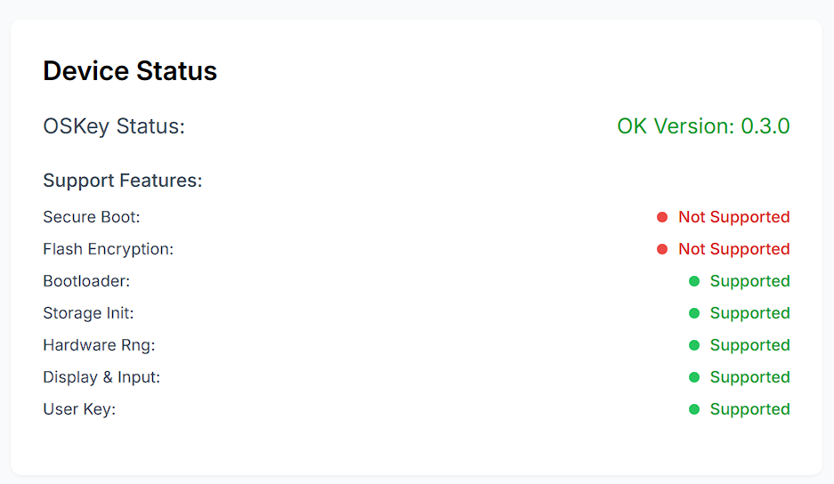
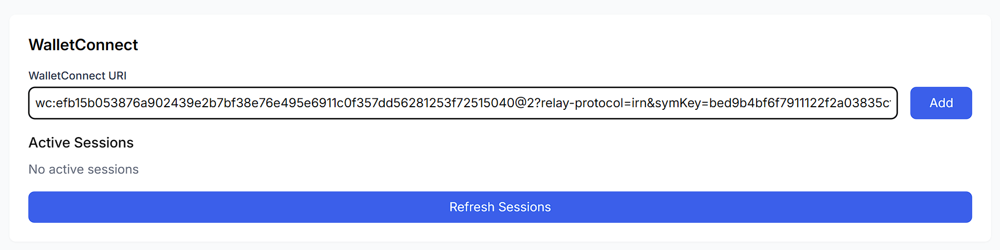

| WeChat                          | Telegram                    |
| ------------------------------- | --------------------------- |
|  | 

# How to Use

First, click to open the OHW official test page [https://ohw-app.vercel.app](https://ohw-app.vercel.app/).

## Checking the Version

Click the Connect button in the upper left corner, which should change from gray "Connect" to green **Connected**. If it doesn't change, other tabs or apps may have opened the connection; please ensure they are closed.

The OHW Status bar should display the firmware version number in green, for example **OK Version: 0.0.2**. If it shows "Not Found ohw firmware, Please [check the manual](https://github.com/butterfly-community/ohw-elf-firmware)!", please make sure you have followed the instructions to write the firmware.

If you have completed the [Firmware Quick Flashing Guide](https://github.com/butterfly-community/ohw-elf-firmware/tree/master/doc/board) and still see this prompt, 🔴⚠️please **reconnect** the hardware wallet or press the **RST** button on the hardware wallet to restart the wallet firmware as described in the guide⚠️🔴.

## Mnemonic Phrase

OHW supports importing or generating mnemonic phrases.

### Generating a Mnemonic Phrase

Click Generate to create a default 24-word mnemonic phrase. Please write it down on paper and do not copy, screenshot, or photograph it.

 

### Importing a Mnemonic Phrase

Enter your existing mnemonic phrase with words separated by spaces, then click import. Please note that the current version only supports mnemonic phrases in **English**.

 

### Important Notes

The generated mnemonic phrase will only be displayed once, so please take care to write it down. Refreshing the page will cause it to **permanently** disappear, with no way to recover it.

 

## Generating an Address

By default, the first address from the Ethereum path is generated, specifically **m/44'/60'/0'/0/0**. You can choose other paths. Click **Get Address** to obtain the address.

## Signing

You can sign input text here. Click **Sign Message**, and after 1-10 seconds (depending on the chip performance), the **Signature** corresponding to the address will be displayed.

## Direct Connection

Using OpenBuild as an example, this section explains how to use Web3 login and interact with apps. [Click here](https://openbuild.xyz/) to open OpenBuild.

### Establishing a Connection

Click on the upper right corner of the OpenBuild website to enter the login page, then click **Wallet** to log in. In the popup window, select **WalletConnect**. At this point, you can either scan the QR code or click the **OPEN** button below. Click on the **marked area** in the image below to copy the connection.

 

Next, add the obtained link to the **WalletConnect** field on the OHW test page, and click **Add.**

 

A connection confirmation prompt will appear. Click confirm to establish the connection with the OpenBuild website.

 

### Interaction

Next, OpenBuild will request a **signature** of a random number to verify ownership of the current address.

 

After confirming, wait 5-10 seconds to log in to OpenBuild. At this point, you are connected to OpenBuild and can continue operations.

## Client Connection

The OHW client is still under development. For now, you can choose to use OneKey, which is another well-known wallet manufacturer. OHW can integrate with it to provide a complete experience. [Click to visit the OneKey official website](https://onekey.so/).

### Establishing a Connection

OneKey has clients for all platforms. This section uses the browser extension wallet as an example to explain how to connect and conduct transactions. After installing the wallet extension in your browser, click on the extension, open this page, and select **Connect Wallet**.

 

Click **EVM** -> **WalletConnect** in sequence, then click here or scan the QR code to get the link.

 

Return to the OHW test page to **add** the link and **confirm** the connection.

 

At this point, the connection has been established, and the browser extension should **display the list of assets** held.

 

### Initiating a Transaction

Using a transfer on Ethereum Sepolia Testnet as an example, click **confirm**.

 

The OHW test page receives a signature request, **confirm** it.

 

Return to the extension wallet, and the transaction is successful.

## Special Reminder

The WalletConnect service used for direct connection or client connection may be unstable within China. If disconnection occurs, please reconnect.

**There is no partnership between OHW and OneKey**.

### Demonstration Video

Here is a demonstration video, which is the video version of the text and images below.

## WeChat
