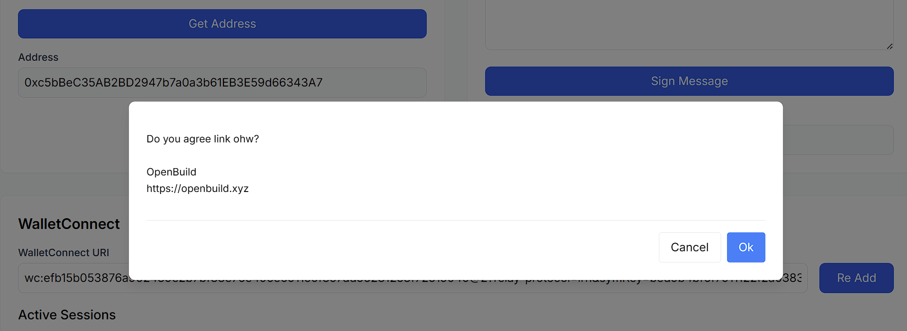

| WeChat                          | Telegram                    |
| ------------------------------- | --------------------------- |
|  | 

# 如何使用

本文假设您已经完成[主页](https://github.com/butterfly-community/oskey-firmware)的开发教程或者按照[固件快速写入指南](https://github.com/butterfly-community/oskey-firmware/tree/master/doc/board)已经把最新版本固件写入开发板。

首先点击打开 OSKey 官方网站[https://www.oskey.xyz/settings](https://www.oskey.xyz/settings) 。

### 演示视频

这里有一个演示视频，是下方文字图片的视频版本。

## 检查版本

点击左上角 Connect 按钮应该从灰色的 Connect 变为绿色的 **Connected**，如果未变更则有其他标签页或者 App 打开了连接，请确认关闭。

OSKey Status 栏应显示绿色的固件版本号，例为 **OK Version: 0.3.0**。如果显示 Not Found OSKey firmware， 请确认已经写入固件或者断开连接尝试选择其他接口。

如果您已经完成[固件快速写入指南](https://github.com/butterfly-community/oskey-firmware/tree/master/doc/board)，仍然出现该提示，🔴⚠️请按照指南描述**重新插拔**硬件钱包或者按压硬件钱包上的 **RST** 按钮以重启应用钱包固件⚠️🔴。

 

## 助记词

OSKey 支持导入或者生成助记词。

 

### 生成助记词

点击 Generate 默认会生成 24 个单词的助记词，请抄写在纸上，请勿复制截图拍照等。

 

### 导入助记词

如果您已经有助记词，可以选择导入功能，输入按空格分隔的助记词，点击导入，请注意当前版本只支持**英语**的助记词。

 

### 注意

生成助记词只会显示一次，请注意抄写。刷新页面会**永久**消失，无法恢复。

 

## 生成地址

默认从以太坊路径的第一个地址生成，即 **m/44'/60'/0'/0/0**，您可以选择其他路径。点击 **Get Address** 获取地址。

 

## 签名

此处可对输入的文本进行 EIP-191 签名，点击 **Sign Message**，显示对应地址的私钥进行的的签名结果。

## 直接连接

以 OpenBuild 为例，讲解如何使用 Web3 登陆以及和 App 交互。[点击此处](https://openbuild.xyz/)打开 OpenBuild。

### 建立连接

点击 OpenBuild 网站右上角进入登陆页，点击 **Wallet** 登陆。在弹出的窗口中选择 **WalletConnect**。此时可以识别二维码内容复制或者点击下方 **OPEN** 按钮。点击下图**标记处**复制连接。

 

接下来将获取到链接添加到 OSKey 测试页的 **WalletConnect** 栏，并点击 **Add。**

 

 

此时弹出连接确认提示，点击确认即可建立与 OpenBuild 网站的链接。

 

### 交互

接下来 OpenBuild 请求对一个随机数**签名**，已验证对当前地址的所有权。

 

确认后等待 5-10 秒，即可登陆 OpenBuild。此时已连接 OpenBuild，您可以继续操作。

## 客户端连接

OSKey 的客户端还在开发中，暂时可以选择使用 OneKey，OneKey 是一家知名的钱包厂商，OSKey 可以接入OneKey 提供完整体验。感谢 OneKey 的开放和提供了易用的钱包客户端 [点击打开 OneKey 官网](https://onekey.so)。

### 建立连接

拥有全平台客户端，此处以浏览器插件钱包为例讲解如何接入以及进行交易。浏览器安装钱包插件后点击扩展，打开此页，选择**连接钱包**。

 

依次点击 **EVM** -> **WalletConnect**，点击此处或者识别二维码获取链接。

 

回到 OSKey 设置页**添加**链接，并**确认**连接。

 

 

此时已经建立链接，浏览器插件应**显示持有的资产**列表。

 

### 发起交易

以在 Ethereum Sepolia Testnet 转账为例，点击**确认**。

 

OSKey 设置页收到签名请求，**确认**。

 

回到插件钱包，交易成功。

 

您也可以选择通过 OneKey 使用各种 App，会比直连有更好的体验。

## 特别提醒

直接连接或者客户端连接使用的 WalletConnect 服务在中国境内连接不稳定，如果出现断联请重新连接。

**OSKey 和 OneKey 没有合作关系**。

